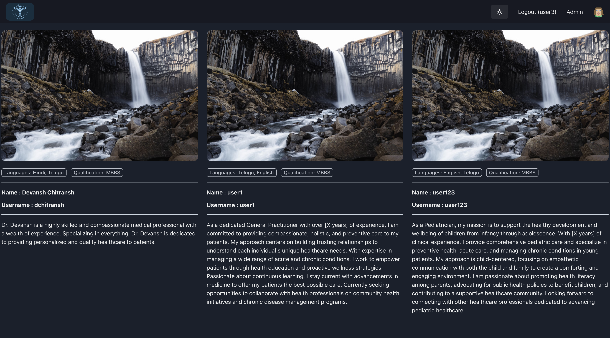
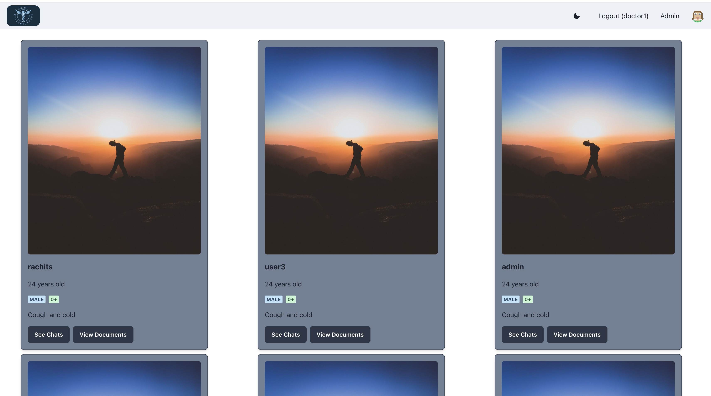
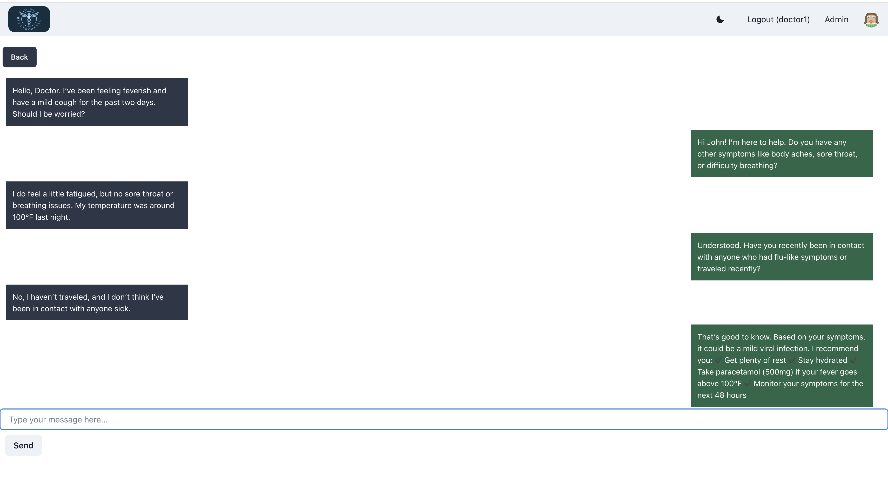
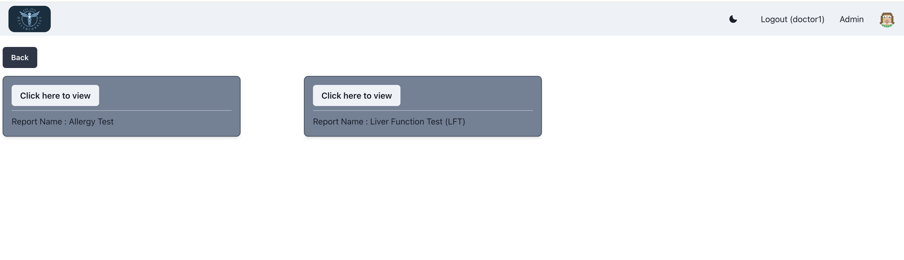

Health Connect 🏥💬
A web-based Health App that connects patients with doctors, allowing seamless communication, report sharing, and doctor management.

🚀 Features   
✅ Patient Login/Signup – Patients can create an account and log in.  
✅ Doctor Login/Signup – Doctors can register and manage their profiles.  
✅ Admin Panel – Admins can add and manage doctors.  
✅ Chat Functionality – Patients can chat with doctors for consultations.  
✅ Report Sharing – Patients can upload and share reports with doctors.  

🛠️ Tech Stack  
Frontend: React.js, Chakra UI  
Backend: Node.js, Express.js  
Database: MongoDB  
Authentication: JWT (JSON Web Token)  
Real-time Chat: Firebase  
File Uploads: Firebase  

🖥️ Usage  
Register/Login as a patient, doctor, or admin.  
Admin can add doctors through the admin panel.  
Patients can chat with doctors for consultations.  
Patients can upload medical reports and share them with doctors.  

## 📸 Screenshots

### 1️⃣ Home Page  

### 3️⃣ Doctor Home Page 

### 2️⃣ Chat Feature  

### 3️⃣ Report Sharing  

